# No he sido yo

Un juego online divertido de preguntas de temáticas a elegir sobre hipotéticas situaciones para jugar con tus amigos.
Esta programado con html, css, javascript y php. El sistema online se hizo con un sistema de ficheros y comandos, en ese momento no conocía los websockets.
Es una copia de un juego que ya existe para play4 llamado Has sido tú. Pero mi juego es de móvil u ordenador.
 

El inicio de la aplicación pasado el login es este:
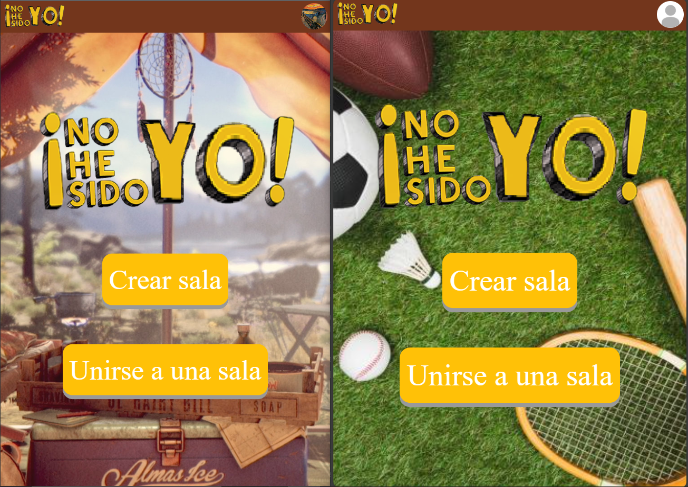
  
Un jugador creará una sala, y será el líder de la sala, podrá expulsar a jugadores si quiere a parte de más cosas que se nombrarán más tarde.
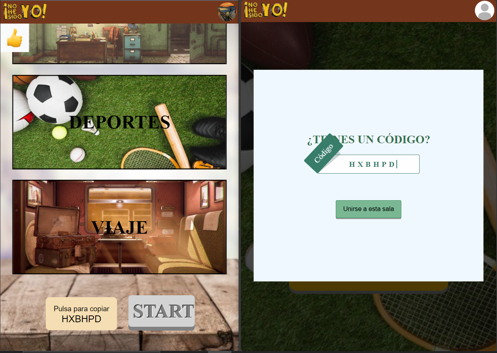
  
Los jugadores cuando estén en la sala y durante la partida, podrán reaccionar cuando quieran con los emojis situados arriba a la izquierda. 
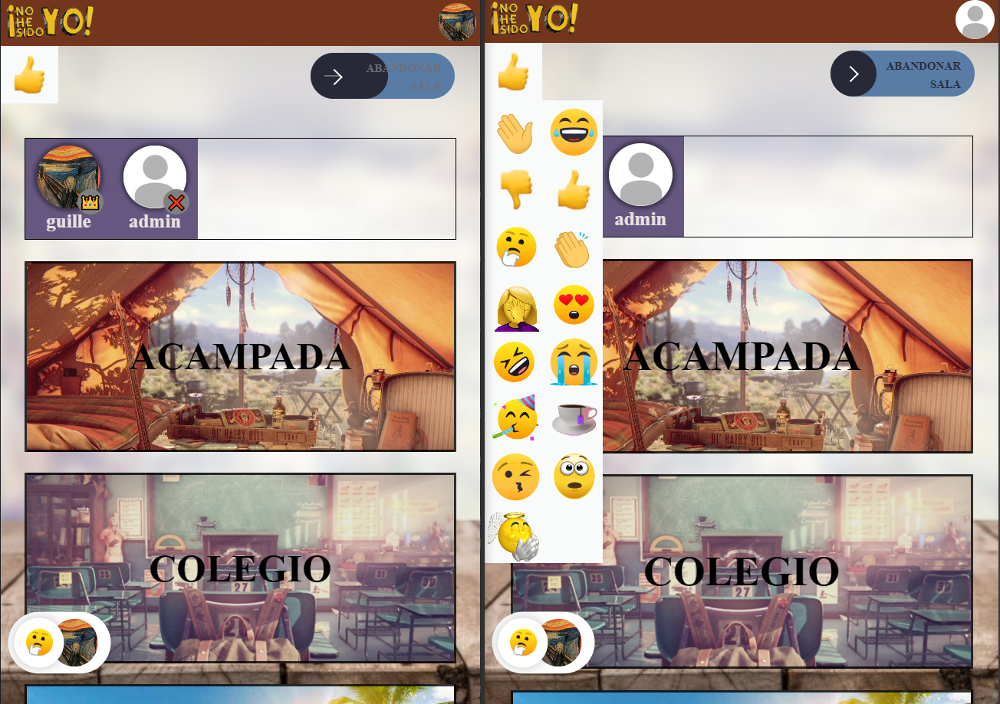
 
 
El líder de la sala o por votación hablada entre los diferentes jugadores, eligirán una temática de preguntas, las temáticas son:
 
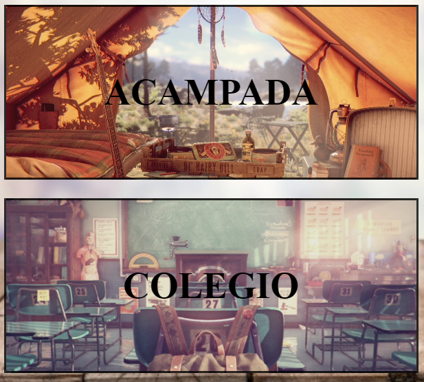
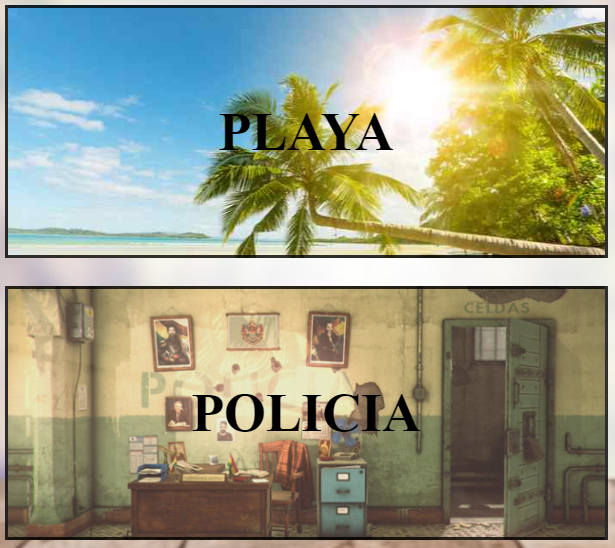
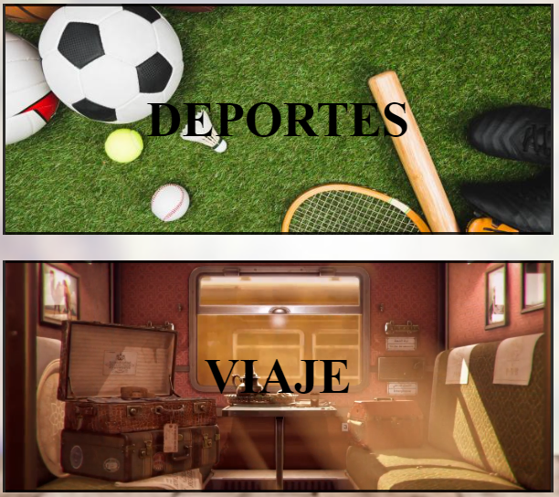
 
 
Hay varios tipos de preguntas:
 
 
Preguntas en las que los propios jugadores son la respuesta:
 
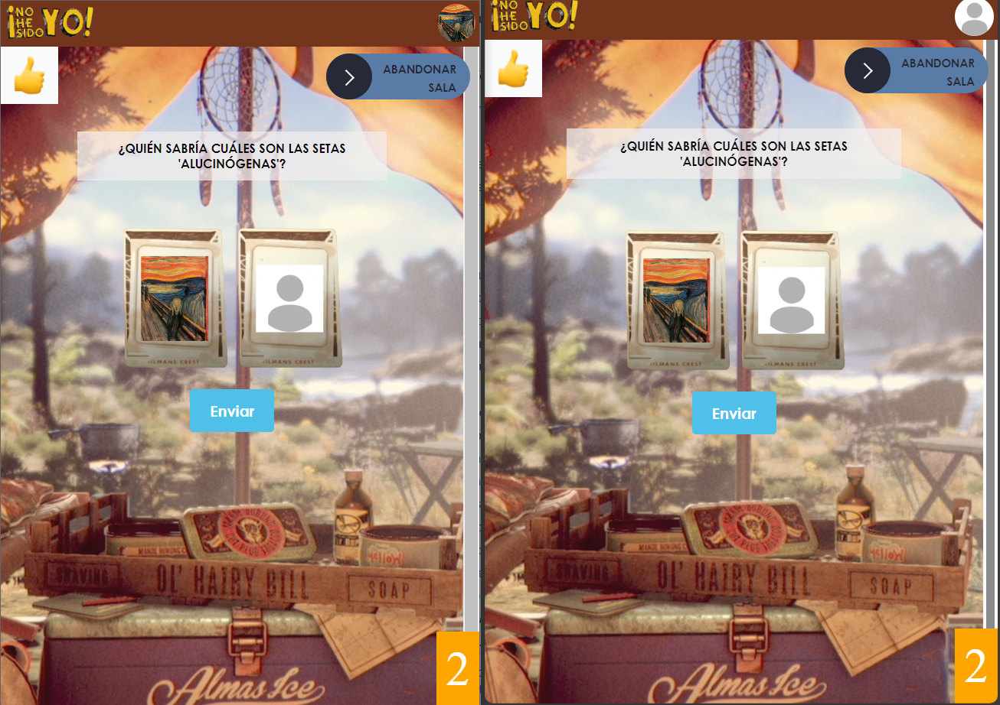
 
 
Preguntas en las que hay imágenes como respuesta:
 
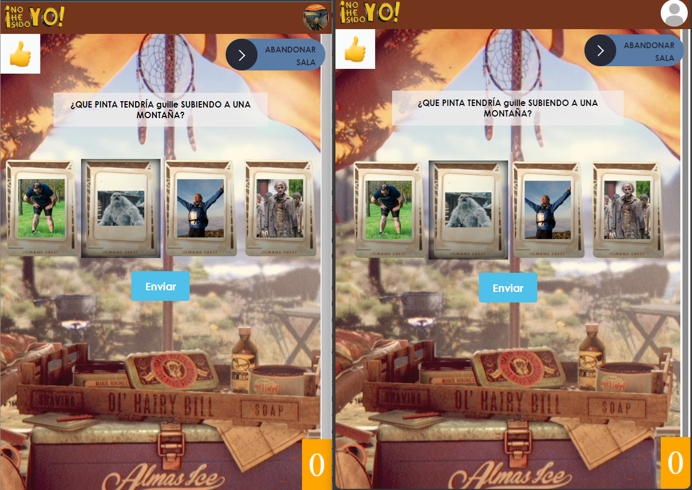
 
 
Preguntas de texto:
 
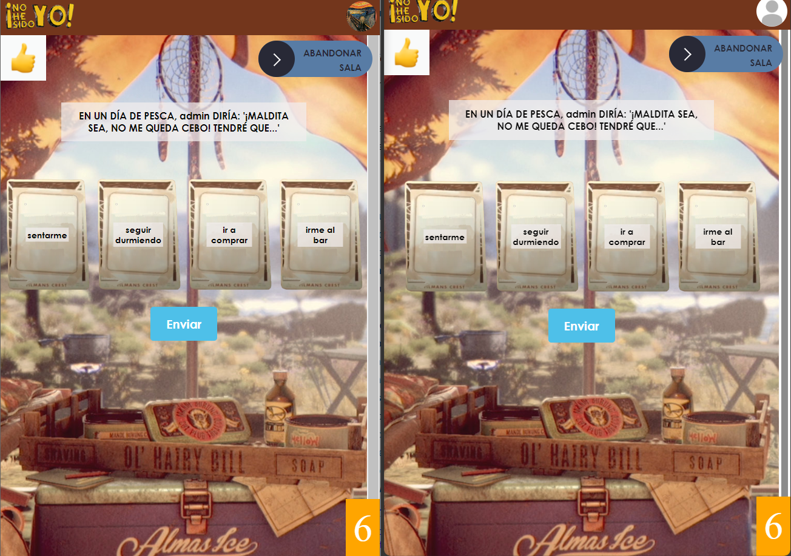
 
 
Preguntas de foto:
 
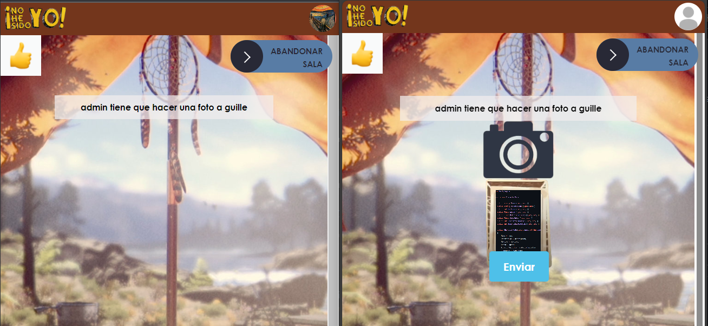
 
 
Habrá 12 preguntas por partida, que se elegirán aleatoriamente desde la BBDD, de todas las que haya de la temática escogida por el líder de la sala. Ganará quien más puntos tenga, los puntos se consiguen contando las cartas votadas iguales a las de cada jugador, es decir, si hay 6 jugadores, y 2 de ellos votan lo mismo, esos 2 jugadores tendrán 2 puntos cada uno.
 
El proceso de cada pregunta siempre es el mismo, lo explicaré con la de tipo de pregunta de imágenes pero con las demás es similar:  
Primero a todos los jugadores se les muestra la pregunta y las posibles opciones a votar: 
  
Después, se espera a que todos los jugadores hayan votado:  
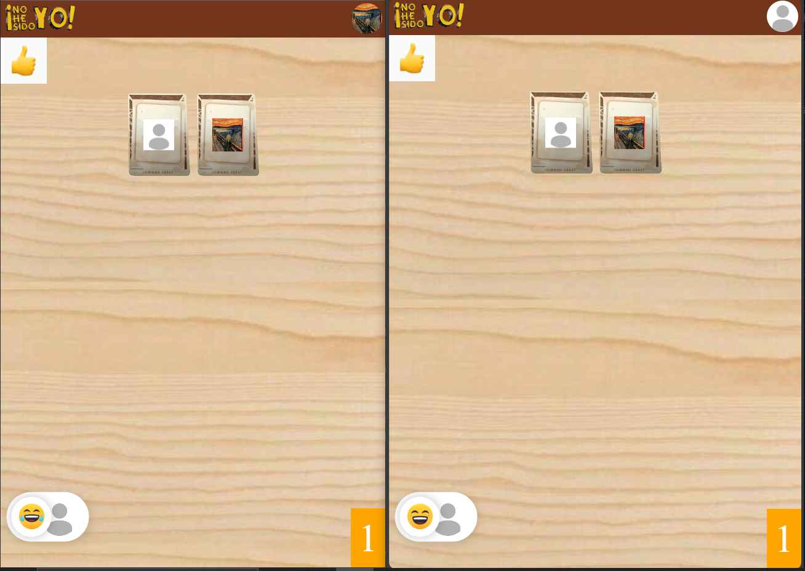  
Y cuando hayan votado todos los jugadores, se revelan los votos y se calculan y muestran los puntos:  
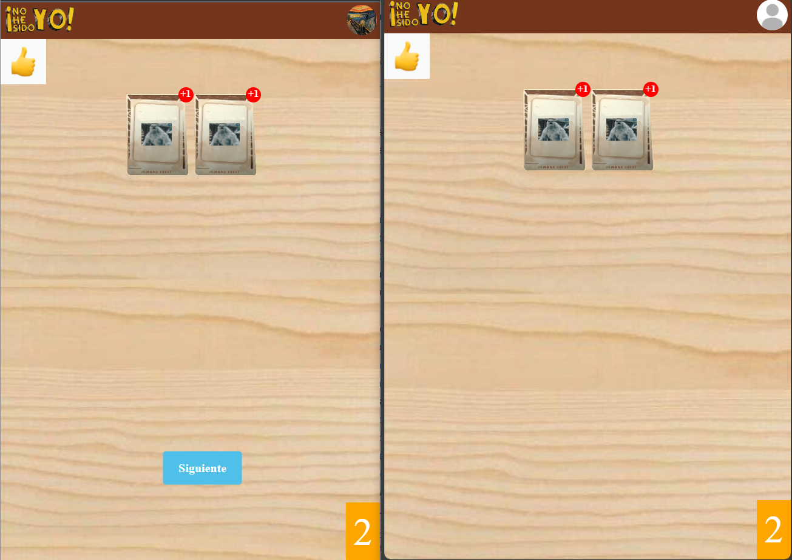  
Las preguntas de fotos son ligeramente diferentes: 
 
Primero se eligen 2 jugadores de esa sala aleatoriamente, y uno de ellos le tendrá que hacer la foto al otro: 

  
Cuando haya hecho la foto al otro jugador, la envía y todos reciben la foto, y tendrán que dibujar sobre la foto lo que indique el enunciado: 
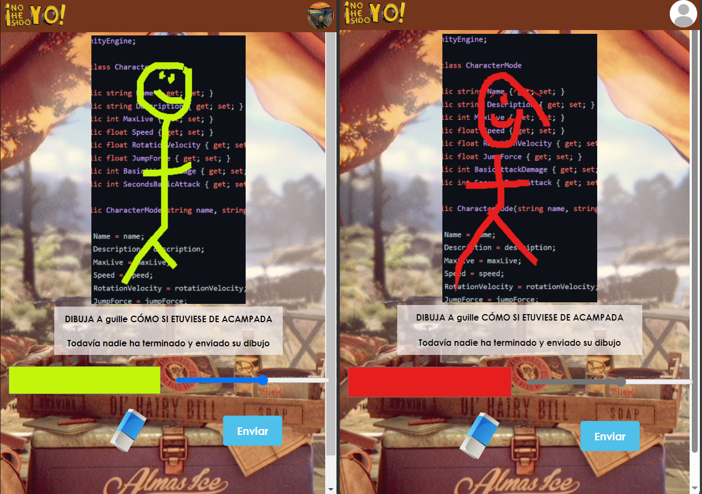
  
Cuando todos los jugadores envíen su dibujo, a partir de aquí, es como el resto de preguntas, se vota una opción: 
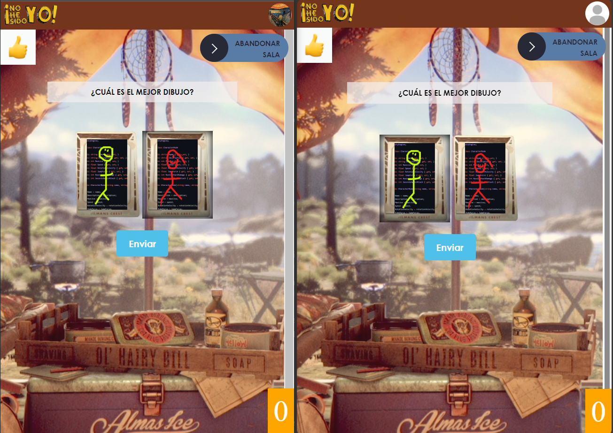
  
Y se calculan y muestran los votos: 
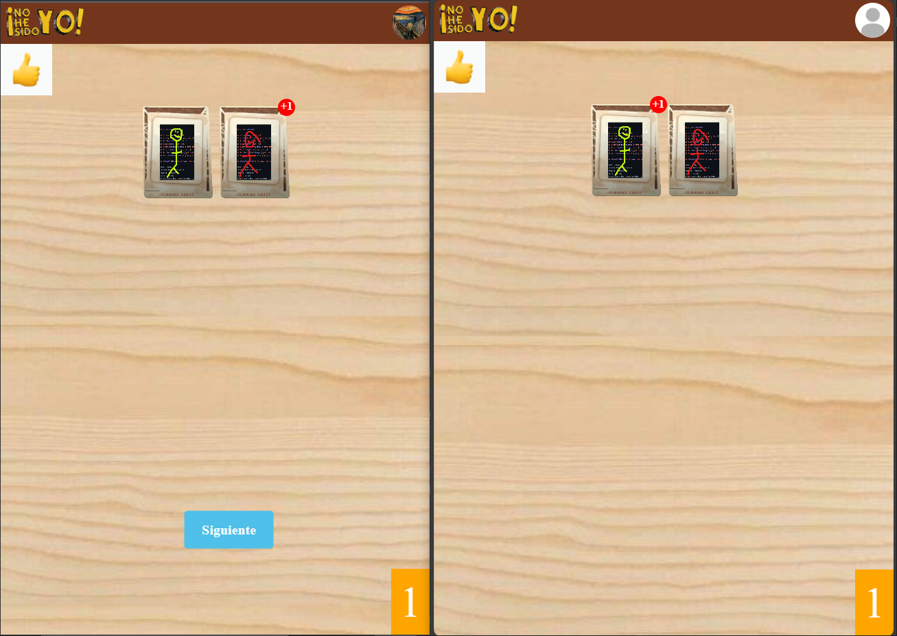
  
Al final de cada partida, se mostrará una tabla de los jugadores ordenado por sus puntos, quien esté arriba del todo, habrá ganado la partida: 
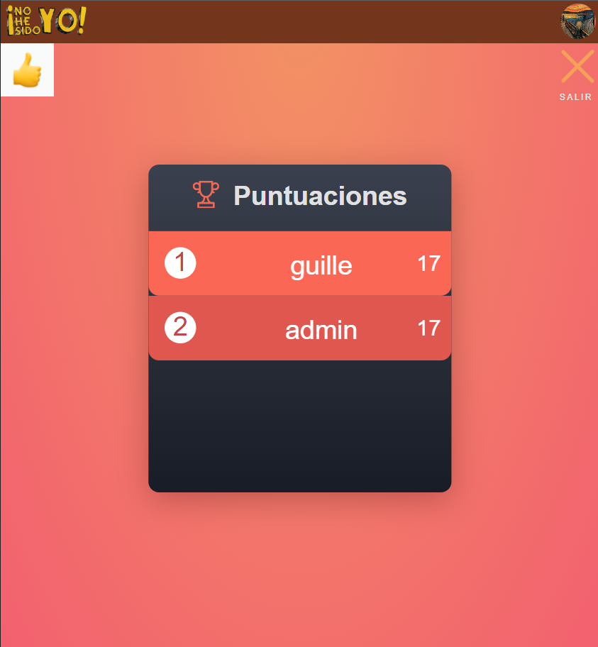
